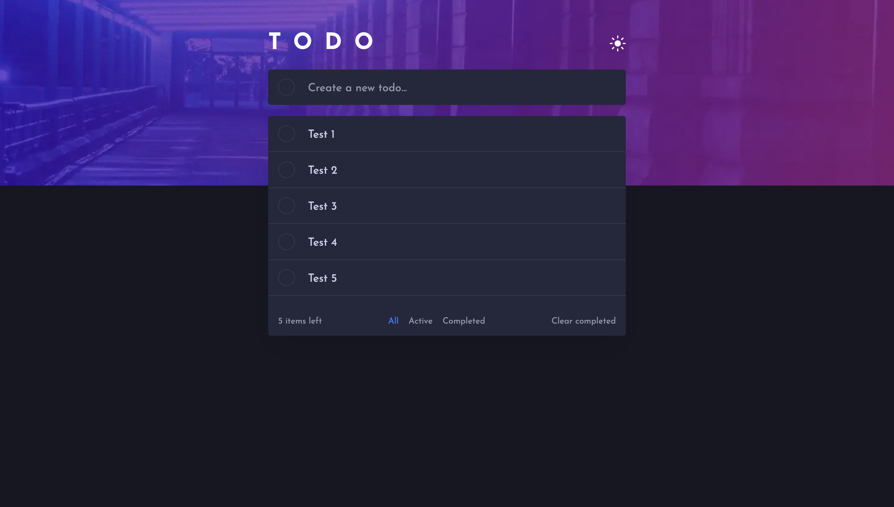

# Todo app

This is a solution to the [Todo app challenge on Frontend Mentor](https://www.frontendmentor.io/challenges/todo-app-Su1_KokOW).

## Table of contents

- [Overview](#overview)
    - [The challenge](#the-challenge)
    - [Screenshots](#screenshots)
- [My process](#my-process)
    - [Built with](#built-with)

## Overview

### The challenge

Users should be able to:

- View the optimal layout for the app depending on their device's screen size
- See hover states for all interactive elements on the page
- Add new todos to the list
- Mark todos as complete
- Delete todos from the list
- Filter by all/active/complete todos
- Clear all completed todos
- Toggle light and dark mode
- **Bonus**: Drag and drop to reorder items on the list

### Screenshots

## My process

### Built with

- [Typescript](https://www.typescriptlang.org/) - Main language
- [React](https://reactjs.org/) - JS/TS library
- [Next](https://nextjs.org/) - React Framework
- [Styled Components](https://styled-components.com/) - For styles
- [React Beautiful DND](https://github.com/atlassian/react-beautiful-dnd) - Dnd library
- [React Transition Group](https://github.com/reactjs/react-transition-group) - Animation library
- [ESLint](https://eslint.org/) - Linter
